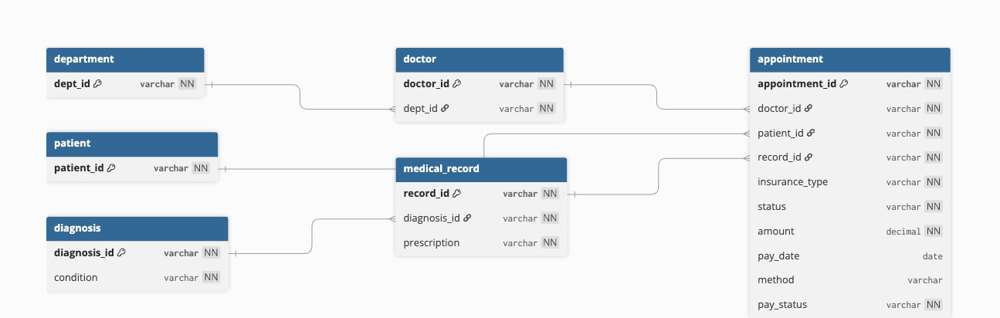

# 🏥 Hospital Management Database System

**Production-ready MySQL 5.7 hospital database** with complete **ER design, 3NF normalization, constraints, CRUD operations, and advanced analytics**.

[](er-diagram/DBML-format-updated.jpg)

## 🚀 Features

- **6-table 3NF normalized schema** (36 realistic German hospital records)
- **18+ constraints** (PK, FK, UNIQUE, NOT NULL)
- **7 performance indexes** for fast JOINs
- **Multi-table JOINs** (3-5 tables demonstrated)
- **Advanced analytics** (GROUP BY, subqueries, aggregations)
- **Full CRUD operations** with transaction safety
- **German healthcare standards** (GKV/PKV insurance, ICD-10 codes)

## 📊 Business Capabilities

| Feature | Status |
|---------|--------|
| Department revenue ranking | ✅ Working |
| Doctor performance analytics | ✅ Working |
| Patient treatment history | ✅ 5-table JOIN |
| Payment collection dashboard | ✅ 100% collection rate |
| Insurance billing (GKV/PKV) | ✅ Tracked |

## 🛠 Quick Start

```bash
1. Create tables
mysql -u root -p hospital_db < sql/01_create_tables.sql

2. Load sample data
mysql -u root -p hospital_db < sql/02_insert_sample_data.sql

3. Test queries
mysql -u root -p hospital_db < sql/04_select_joins.sql

text

## 📁 File Structure
├── README.md # This file
├── sql/
│ ├── 01_create_tables.sql # Schema + constraints
│ ├── 02_insert_sample_data.sql # 36 realistic records
│ ├── 03_update_delete.sql # CRUD operations
│ ├── 04_select_joins.sql # 3-5 table JOINs
│ └── 05_advanced_queries.sql # GROUP BY, subqueries
└── er-diagram/
└── DBML-format-updated.jpg # Complete ER diagram

text

## 🎯 Key Results
💰 Total Revenue: €410.20 across 5 appointments
👨‍⚕️ Top Doctor: Dr. Elena Fischer (Orthopedics) - €120
🏥 Top Department: Orthopedics - €120 revenue
📈 100% Payment Collection Rate
🔍 5-table JOIN: Complete patient treatment journey

text

## 🏆 Technical Achievements

- ✅ **MySQL 5.7 compatibility** (no window functions)
- ✅ **3NF normalization** verified
- ✅ **Referential integrity** (no orphan records)
- ✅ **Production constraints** (18+ total)
- ✅ **Strategic indexing** (7 indexes)
- ✅ **Transaction safety** demonstrated

## 📸 Screenshots

**Query Results:** [JOIN queries](image.jpg) | [Advanced analytics](image.jpg)

## 🔮 Future Enhancements

- MySQL 8.0 upgrade (window functions)
- Audit trail (`created_at`, `updated_at`)
- Appointment scheduling calendar
- Multi-hospital sharding
- REST API layer

## 📄 License

[MIT License](LICENSE) © 2026

---

**Built for production deployment** • **German hospital standards** • **Enterprise-grade analytics**
